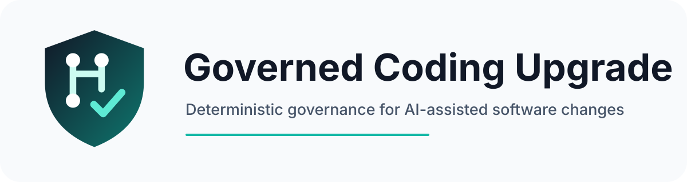

<p align="center">
  
</p>

<p align="center">
  <strong>A deterministic governance protocol for AI-assisted software changes.</strong><br>
  Frozen scope. Executable proof. Exact-head audit. Evidence-based release.
</p>

<p align="center">
  <code>v1.0.0</code> · <strong>99/100 semantic quality score</strong> · <strong>All 5 areas ≥19/20</strong>
</p>

---

# Governed Coding Upgrade

**Governed Coding Upgrade (GCU)** is a project-agnostic execution skill for coding agents and engineering teams. It converts software changes from an informal edit/test loop into a controlled lifecycle with explicit scope, checklist IDs, direct evidence, deterministic verification, independent exact-head audit, bounded correction, and release authorization.

It is designed for feature work, defects, refactors, migrations, dependency upgrades, security changes, performance work, configuration changes, CI/CD changes, infrastructure-as-code, schema changes, and other modifications that can alter executable behavior.

## Why it exists

AI coding tools can make changes quickly, but speed alone does not prove that the right files changed, required behavior exists, protected contracts remain intact, negative paths fail correctly, CI ran on the actual final commit, or a model did not simply declare its own work complete.

GCU makes those claims measurable.

## Governed lifecycle

```text
INTAKE
  ↓
PREFLIGHT
  ↓
PROJECT PROFILE
  ↓
FROZEN CHECKLIST
  ↓
EXECUTION PLAN
  ↓
BUILD
  ↓
VERIFY
  ↓
INDEPENDENT EXACT-HEAD AUDIT
  ↓
CONSOLIDATED CORRECTION (only if required)
  ↓
RE-AUDIT
  ↓
CLOSE / RELEASE
```

### Non-negotiable controls

- Scope is frozen before implementation.
- Every checklist item has a stable ID and direct proof.
- Permitted and prohibited files are explicit.
- Protected invariants are identified before editing.
- Completion requires executable evidence rather than prose or confidence.
- CI and audit must correspond to the exact final head.
- The implementation cannot authorize its own release.
- Audit failure produces one consolidated correction package rather than fragmented fixes.
- Merge, deploy, release, or activation remains subject to explicit authorization.

## Repository structure

| Path | Purpose |
|---|---|
| [`SKILL.md`](SKILL.md) | Authoritative universal coding-upgrade skill |
| [`GLOBAL_CLAUDE_RULE.md`](GLOBAL_CLAUDE_RULE.md) | Mandatory invocation rule for the global agent instruction layer |
| [`SCORECARD.md`](SCORECARD.md) | Five-area semantic quality assessment |
| [`docs/ARCHITECTURE.md`](docs/ARCHITECTURE.md) | Control model, gates, roles, and project adapter architecture |
| [`docs/ADOPTION_GUIDE.md`](docs/ADOPTION_GUIDE.md) | Installation and repository onboarding procedure |
| [`templates/`](templates/) | Governed profile, checklist, audit, correction, and final-report templates |
| [`.github/`](.github/) | Pull-request, issue, security, ownership, and CI governance |
| [`scripts/validate-package.py`](scripts/validate-package.py) | Zero-dependency package integrity validator |
| [`PUBLISH_TO_GITHUB.ps1`](PUBLISH_TO_GITHUB.ps1) | One-command private GitHub repository publisher |
| [`branding/`](branding/) | Repository logo, icon, and social-card assets |

## Installation model

GCU has two layers:

1. **Execution skill** — install `SKILL.md` wherever the coding agent loads reusable skills.
2. **Mandatory invocation rule** — add `GLOBAL_CLAUDE_RULE.md` to the global instruction layer so qualifying coding changes cannot silently bypass the skill.

Each codebase then supplies repository-specific facts through a **Governed Change Profile**. The profile maps the universal protocol to the repository's real commands, CI, protected invariants, migration rules, external-call rules, rollback mechanism, and release controls.

Start with [`docs/ADOPTION_GUIDE.md`](docs/ADOPTION_GUIDE.md).

## Proof model

A completion claim is valid only when the relevant evidence is inspectable. Examples include:

- exact test assertions;
- exact lifecycle/state history;
- persisted state;
- stored artifacts and hashes;
- call/write counts;
- command and exit status;
- exact changed-file list;
- exact final SHA;
- CI tied to that SHA;
- independent audit result.

Test names, comments, green CI by itself, prose claims, and confidence percentages are not substitutes for governed proof.

## Semantic quality gate

The current release was accepted only after all five semantic areas met the required threshold.

| Area | Score |
|---|---:|
| Governance & Control | **20/20** |
| Execution Process & Determinism | **20/20** |
| Testing, Evidence & Audit Quality | **20/20** |
| Automation & Delivery Efficiency | **19/20** |
| Generalizability & Portability | **20/20** |
| **Total** | **99/100** |

See [`SCORECARD.md`](SCORECARD.md) for the complete rationale.

## Design principle

> A coding change is not complete because an agent says it is complete. It is complete when frozen requirements are satisfied by direct evidence at the exact release candidate head and the required independent audit passes.

## Status

**Version:** 1.0.0  
**Release state:** Stable governing protocol  
**Repository visibility:** Intended to begin private  
**Copyright:** © 2026 Chris Kulbaba. All rights reserved.
